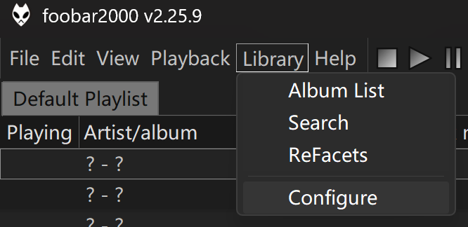
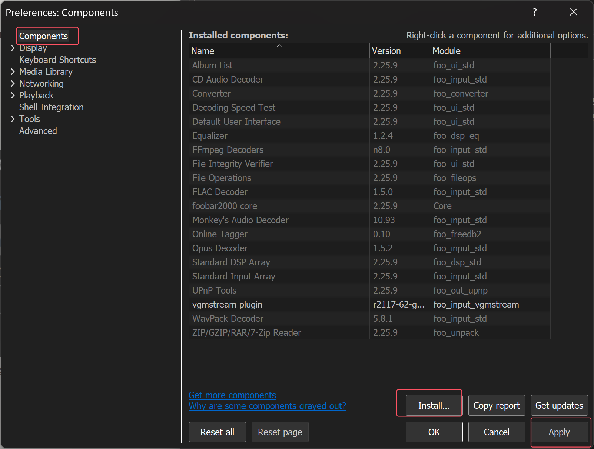
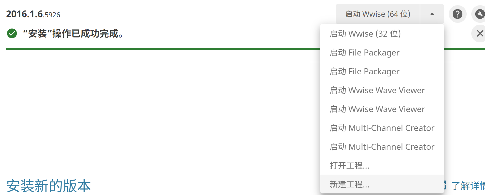
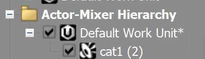
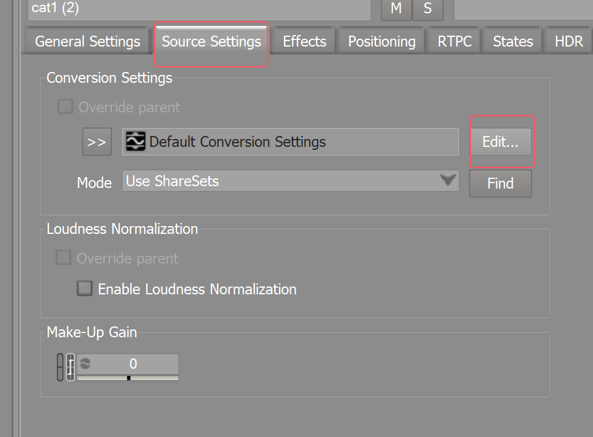
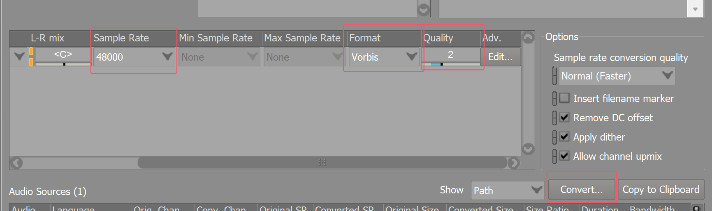

# DmC鬼泣音频mod制作学习

DmC鬼泣音频文件为 .apk 格式，音频封装为“容器套容器”的过程，经解包后才能查看具体的单个音频并进行修改

```
APK（AudioPackage，音频资源包）
└── 多个 BNK（Wwise SoundBank，Wwise 音频库）
    └── 若干 WEM（Wwise Encoded Media，编码的音频流）
```

因此音频mod制作流程为 **音频解包→对应音频文件修改→重新封装**

*要下载的工具包已包含，需要安装的软件包在data中

## 目录结构

```bash
DmC_audio/
├── datas/					# 原始文件
│   ├── apks/				# 原始apk
│   ├── pics/				# readme.md里用到的截图
│   └── tools/				# 相关软件包
├──  models/
│   ├── quickbms_win/		# 通用音频转换工具
│   ├── Scripts/			# DmC相关脚本
│   ├── Wwiser_Python/		# 音频文件查看工具
│   └── Readme.txt
└── output/					# 存放处理过程中的bnk、wem等文件以及最终输出
```

## 原始文件获取

可在游戏文件夹中直接搜索关键字apk

本体音频文件在`\DevilGame\CookedPCConsole`中，前缀为`Main_`，DLC音频文件在`\DevilGame\Published\Content\DLCVergilsDownfall`中，前缀为`DLC1_`

无后缀的为通用音效，加了后缀的为不同语言的语音，默认使用的英语为`_INT`

我将原始Main_PC.apk保存在了`DmC_audio\datas\apks`下。建议备份原始文件

## 音频解包

下载文件提取工具：[QuickBMS](https://github.com/LittleBigBug/QuickBMS/releases)、BMS脚本（编者AlphaTwentyThree，下载来源[【DmC鬼泣】音频结构拆解和mod思路参考 未完全](https://www.bilibili.com/video/BV1B6jB67EVL/)简介）

在根目录`DmC_audio`打开cmd，使用命令分别抽取出bnk文件和wem文件：

*如果对要替换的wem文件id、音频信息足够确认的话，只抽取bnk文件就行

```bash
【QuickBMS下载目录】\quickbms.exe 【文件地址】\DmC_APK_to_BNK.bms 【文件地址+.apk格式的文件名】 C:\Users\Admin\Desktop\Extracted_BNK【此条无需更改，回车后键入Y回车就会在桌面生成文件夹】
【QuickBMS下载目录】\quickbms.exe 【文件地址】\DmC_BNK_to_WEM.bms 【文件地址】\Extracted_BNK C:\Users\Admin\Desktop\Extracted_WEM
```

例：

```
models\quickbms_win\quickbms.exe models\Scripts\DmC_APK_to_BNK.bms apks\Main_PC.apk output\Extracted_BNK

models\quickbms_win\quickbms.exe models\Scripts\DmC_BNK_to_WEM.bms output\Extracted_BNK output\Extracted_WEM
```

解包的bnk文件名为`十六进制ID`；wem文件名为`<WEM的DIDX媒体ID> (<来源BNK文件名>).wem`

### 【可选】查看bnk文件结构

打开操作界面：（设置了python系统路径的话可以直接双击打开）

```
python .\models\Wwiser_Python\wwiser.pyz
```

点击`load dirs`打开`output`文件夹，会自动读取文件夹中所有后缀为bnk的文件

点击`View banks`可查看音频结构，选择mhtml模式能保存为可以发给别人的格式，hmtl只方便自己查看

其中，bnk文件名的`十六进制ID`对应结构中的`bank_names`字段，wem文件名中的`<WEM的DIDX媒体ID>`对应结构中的`media_id`字段

### 【可选】重命名wem文件

下载脚本（位置同前BMS脚本，编者[Attak_Reload](https://space.bilibili.com/3546626115242777/)，个人有对输出名称进行简要修改）

在wwiser操作界面点击`Dump banks`将音频结构保存为txt文件（放在output目录下）

运行重命名脚本：

```
python models\Scripts\rename.py output\banks.txt output\Extracted_WEM
```

会给原始文件加上事件前缀、在bnk中的相对位置，即命名为`事件名_WEM-ID_WEM序号_BNK-ID.wem`

*如果同一个 WEM-ID 在多个 bank 里重复出现，当前实现会保留最后解析到的那条记录

## 替换音频准备

### 检查原始wem文件

下载音频查看工具：foobar2000播放器[foobar2000](https://www.foobar2000.org/)、vgmstream插件[vgmstream](https://vgmstream.org/)

安装插件：

- 打开foobar2000，选择Library（库）→Configure（配置）→Components（组件）

  

- 点击Install，选择下载好的vgmstream文件，点击Apply，并确认重新启动软件

  

打开文件：

- 文件/文件夹都可以直接拖拽进去
- 或者使用File→Add Folder打开文件夹

找到想要修改的音频文件后，右键Properties（属性）→Details中查看General条目下的Duration、Sample rate、Bitrate、Channel（持续时间、采样率、比特率、声道）

### 生成替换wem文件

下载音频处理工具：[Audiokinetic](https://www.audiokinetic.com/en/download)（注册的时候用QQ邮箱不行的话可以用网易邮箱）

在侧面导航栏中选择Wwise并安装**旧的**版本（我自己安装的2016版）

安好后新建工程



点击project→import audio files，选择准备好的wav文件，点击import

*其它格式音频转为wav文件可以用foobar2000，选中文件后右键convert→quick convert，找到WAV后点击convert保存

关闭该窗口后，在左侧导航栏中Actor-Mixer Hiersrchy→default work unit下能看到刚刚导入的音频（目录右上角有个*）



*如果已有打开的项目，可以直接把音频文件拖拽至该目录下

点击该音频，在中间界面的上方导航栏找到source settings，点击edit



设置好Sample rate，format选择vorbis，quality默认4（比特率64），点击convert转换，有个弹窗闪现了一下就是转换好了



项目默认保存在`文档`文件夹下，文件保存位置在项目缓存文件，即`WwiseProjects\项目名\.cache\Windows\SFX`（最后一个文件夹可能是别的名字，应该只会有一个文件夹）可以根据文件名和修改日期找找看刚生成的wem文件

*如果转换后的wem文件比原始文件大，可以减小quality。目前还没尝试过扩大wem和bnk文件的操作

*旧版本wwise对音频的基本操作比较少，如果不想安装软件又想对音频进行基本处理的话可以在浏览器找在线工具

- 音频基本处理：[音频编辑器](https://tools.aihezi.chat/zh/tools/audio-editor/)
- 单声道转多声道：[SoniqTools](https://soniqtools.com/zh/mono-stereo)

> *不可行的方案：使用最新版的wwise
>
> 问题：新版wwise会生成的额外 RIFF chunk，这样处理后的文件与DmC比较旧的解码器不兼容，无法使用

## 音频修改

### 生成新bnk文件

使用命令：

运行bnk覆盖脚本：

```
python models\Scripts\replace_wem_in_bnk.py 【需要修改的bnk文件】 【用于替换的wem文件】 【对应的wem-id】 【输出文件】
```

例：

```
python models\Scripts\replace_wem_in_bnk.py output\Extracted_BNK\5809be10.bnk output\1.wem 99247340 output\Modified_BNK\5809be10.bnk

python models\Scripts\replace_wem_in_bnk.py output\Modified_BNK\5809be10.bnk output\2.wem 361484552 output\Modified_BNK\5809be10.bnk
```

*测试：

```
python models\Scripts\replace_wem_in_bnk.py output\Extracted_BNK\5809be10.bnk output\1.wem 99247340 output\5809be10.bnk --dry-run
```

*这里例子中替换了两次，是因为我尝试替换的音频是但丁镰刀特殊技第二段但丁的语音，这个语音会使用一个单声道wem(99247340) 和一个多声道wem(361484552) 叠加播放，并且作为随机事件以一定概率在游戏中被调用（……）

触发链：

```
Event 1819967080
└── Action 756004009
    └── Switch 910033169
        └── State 361516992
            └── Random/Shuffle 456884204（六选一）
                └── Layer 966537895
                    ├── WEM 361484552
                    └── WEM 99247340
```

> *不可行的方案：使用wwiseutil
>
> 下载音频处理工具：[wwiseutil](https://github.com/hpxro7/wwiseutil/releases)
>
> 打开bnk文件（注：bnk中wem的header默认编号从0开始，打开文件中默认编号从1开始，对应序号要+1）
>
> 问题：操作后的bnk文件用wwiser打不开，可能是原始文件包含额外信息，处理过程中丢失
>
> *不可行的方案：使用BNKEditor
>
> 下载音频处理工具：[BNKEditor](https://github.com/marieismywaifu/BNKEditor/releases/tag/v1.0)（运行需Java环境）
>
> 打开后操作流程和用wwiseutil一样，不过这个没有序号，找起来更麻烦，可以看看wwiseutil里的大概位置
>
> 问题：操作后的bnk文件用wwiser可以打开了，但在游戏中触发一次后会导致后续文件读取错误，原因在于原始文件为16字节对齐，新文件破坏了对齐方式
>
> *遇到的其它问题：（已解决）
>
> 运行一次后该bank失效：文件大小有变化，读取一次后无法正常对应 → 解决：同时修改 DIDX 和 HIRC 保存的大小
>
> 运行一次后所有音频失效：与Wwise Vorbis 的私有声道布局字段有关，这个不是很懂 → 在替换过程中自动进行检查修改，修改过程能在控制台看到

### 生成新apk文件

运行apk覆盖脚本：

```
models\quickbms_win\quickbms.exe -w -r models\Scripts\DmC_APK_to_BNK.bms 【待覆盖apk文件】 【上一步生成的bnk文件所在的文件夹（建议单独放一个文件夹）】
```

例：

```
models\quickbms_win\quickbms.exe -w -r models\Scripts\DmC_APK_to_BNK.bms output\Main_PC.apk output\Modified_BNK
```

如果新 BNK 变大，使用 Reimport2，即（没测试过能不能用）

```
models\quickbms_win\quickbms.exe -w -r -r models\Scripts\DmC_APK_to_BNK.bms output\Main_PC.apk output\Modified_BNK
```

将处理后的apk文件替换游戏目录下的原始apk，即可完成~


## 参考资料

[【新鬼泣】DmC鬼泣音频提取教程](https://www.bilibili.com/video/BV195FEzREwh/)

[【DmC鬼泣】音频结构拆解和mod思路参考 未完全](https://www.bilibili.com/video/BV1B6jB67EVL/)

[DmC Devil May Cry 2013 - Sound Files](https://www.gildor.org/smf/index.php?PHPSESSID=0779f2da93439f72ecad24d97c79e099&topic=1733.15)

[MyBlog/如何快速通过Foobar2000＋vgmstream解包转换游戏音效？](https://github.com/Leoheren/MyBlog/blob/main/如何快速通过Foobar2000＋vgmstream解包转换游戏音效？.md)

[【Wwise Launcher】wav转wem(opus编码)教程-百度贴吧](https://tieba.baidu.com/p/6926439653)

[[HELP\] — .BNK audio file is muted in game after repackaging. Thread - IndieDB](https://www.indiedb.com/forum/thread/help-bnk-audio-file-is-muted-in-game-after-repackaging)